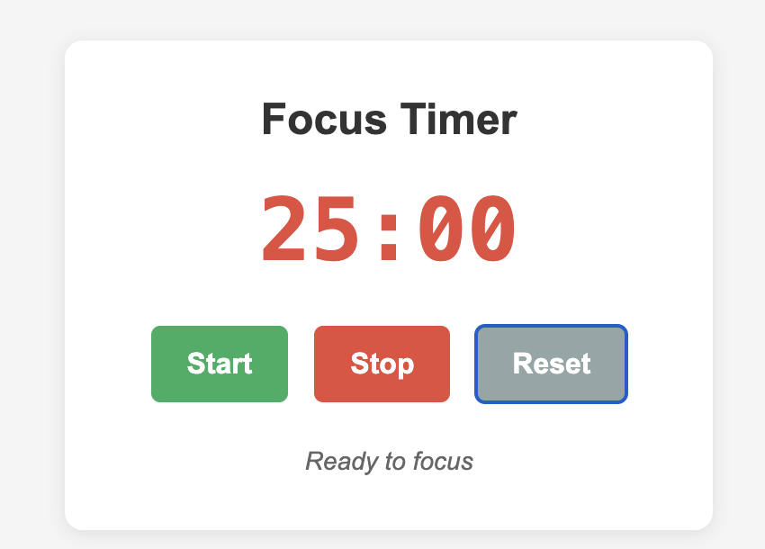

# Focus Timer - Simple Pomodoro Timer

A clean and minimalist Pomodoro timer web application designed to help you stay focused and boost productivity. Built with vanilla HTML, CSS, and JavaScript, this project demonstrates modern web development workflow and deployment practices.

## 📸 Preview



*Clean, modal-style interface with 25-minute countdown timer and simple controls*

## 🚀 Live Demo

🌐 **[View Live Site](https://pomodoro-timer-alpha-murex.vercel.app/)** *(Replace with your actual Vercel URL)*

## ✨ Features

- **25-minute Pomodoro timer** - Standard focus session length
- **Three simple controls:**
  - 🟢 **Start** - Begin the countdown
  - 🔴 **Stop** - Pause the timer
  - ⚪ **Reset** - Return to 25:00
- **Visual feedback** - Status messages guide you through sessions
- **Audio notification** - Alert when timer completes
- **Responsive design** - Works seamlessly on desktop and mobile
- **Clean UI** - Distraction-free modal interface

## 🛠️ Technologies Used

- **HTML5** - Semantic structure and accessibility
- **CSS3** - Modern styling with Flexbox and responsive design
- **Vanilla JavaScript** - Timer functionality and DOM manipulation
- **Git** - Version control and project history
- **GitHub** - Repository hosting and collaboration
- **Vercel** - Automated deployment and hosting

## 🏃‍♂️ Getting Started

### Prerequisites
- A modern web browser
- Git installed on your machine
- Code editor (VS Code recommended)

### Local Development

1. **Clone the repository**
   ```bash
   git clone https://github.com/TaborDev/pomodoro-timer.git
   cd pomodoro-timer
   ```

2. **Open the project**
   ```bash
   # Option 1: Open directly in browser
   open index.html
   
   # Option 2: Use a local server (recommended)
   # With Python 3
   python -m http.server 8000
   
   # With Node.js
   npx http-server
   ```

3. **View in browser**
   - Direct: Open `index.html` in your browser
   - Local server: Visit `http://localhost:8000`

## 📁 Project Structure

```
pomodoro-timer/
├── index.html          # Main HTML structure
├── style.css          # CSS styles and responsive design
├── script.js          # JavaScript timer functionality
├── .gitignore         # Git ignore rules
├── README.md          # Project documentation
└── preview.png        # Screenshot for documentation
```

## How It Works

1. **Default State**: Timer starts at 25:00 (25 minutes)
2. **Start**: Click green "Start" button to begin countdown
3. **Stop**: Click red "Stop" button to pause (can resume with Start)
4. **Reset**: Click gray "Reset" button to return to 25:00
5. **Completion**: Browser alert notifies when timer reaches 00:00

### Key JavaScript Functions

- `startTimer()` - Begins countdown with 1-second intervals
- `stopTimer()` - Pauses the current timer
- `resetTimer()` - Resets to 25:00 and clears any running intervals
- `updateDisplay()` - Updates DOM with current time values

## Design Decisions

### Visual Design
- **Modal-style container** with subtle shadow for focus
- **Color-coded buttons** for intuitive interaction
- **Large, monospace timer** for easy readability
- **Minimal interface** to reduce distractions during focus sessions

### Technical Choices
- **Vanilla JavaScript** - No dependencies, fast loading
- **CSS Flexbox** - Simple, responsive layout
- **Semantic HTML** - Accessible and SEO-friendly structure

## Deployment

This project uses **Vercel** for automated deployment:

1. **Connect GitHub to Vercel**
2. **Import repository**
3. **Automatic deployment** on every push to main branch
4. **Live updates** with zero downtime

### Deployment Benefits
-  Free hosting for static sites
-  Automatic HTTPS
-  Global CDN distribution
-  Integration with Git workflow

##  Contributing

1. Fork the repository
2. Create a feature branch (`git checkout -b feature/improvement`)
3. Make your changes
4. Commit your changes (`git commit -am 'Add new feature'`)
5. Push to the branch (`git push origin feature/improvement`)
6. Create a Pull Request

##  Assignment Context

Created for **COMP 488 Assignment 2** focusing on:
- Basic web development fundamentals
- Git version control practices
- GitHub repository management
- Automated deployment with Vercel
- Professional documentation and workflow

---